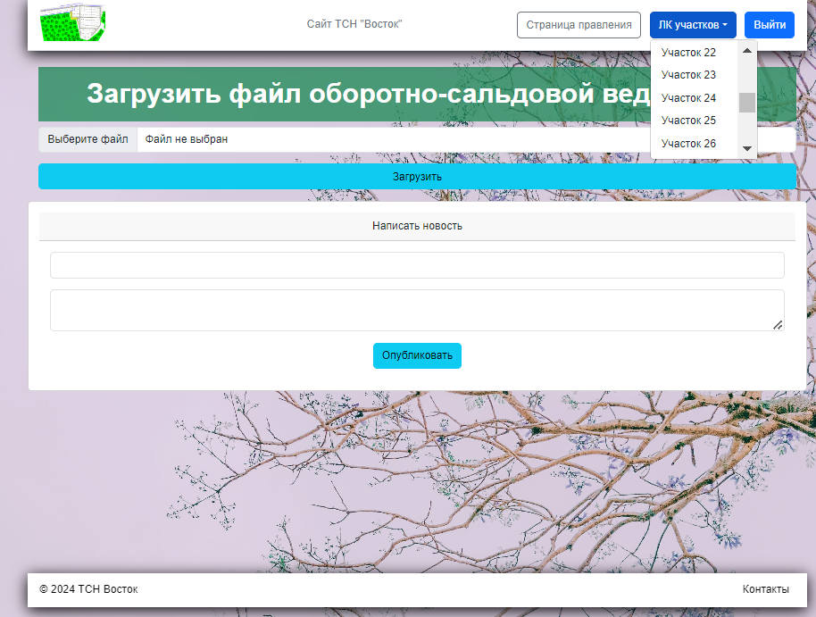

# SNT_project
SNT_project - вэб-приложение (сайт) для СНТ и его членов. На главной 
странице сайта есть колонка новостей и виджет погоды в райне СНТ на сегодня, 
завтра и ближайшие выходные.


С главной страницы можно попасть на страницу контактов, 
на которой приведена информация о фактическом и юридическом расположении СНТ. 
Также на данной странице приведена интерактивная яндекс-карта с расположением СНТ.


Навигационная панель сайта имеет две кнопки: "Войти" и "Зарегистрироваться".
При переходе на страницу регистрации появляется форма регистрации, состоящая 
из нескольких полей: "номер участка", "email", "номер телефона", "пароль", 
"повтор пароля". Форма предусматривает валидацию введенных данных.


Страница логина предлагает ввести зарегистрированный ранее "номер участка", 
а также "пароль". Возможна опция "Запомнить меня" (срок выставлен в 30 календарных дней).


При входе на страницу личного кабинета пользователь видит страницу, на которой
размещена информация о состоянии его счета: задолжности и/или переплате по 
членским и целевым взносам, а также по электричеству. Помимо этого доступна 
возможность скачаивания "Акта сверки". Добавление бухгалтерской информации 
осуществляется из личного кабинета Правления.


Доступ к кабинету правления СНТ осуществляется по нулевому номеру участка.
На странице есть возможность добавления файла оборотно сальдовой ведомости, 
а также добавление новостей, которые буду отражаться на главной странице.
Также, пользователю с правами администратора доступна дополнительная опция 
на навигационной панели - посещение личного кабинета конкретного участка.



### Установка
1. Клонировать репозиторий и создать виртуальное окружение:
```
git clone https://github.com/Largasson/SNT_project
```
2. Установить зависимости - требуемые библиотеки для работы веб-приложения:
```
pip install -r requirements.txt
```
4. Создать файл __.env__ с переменными окружения: 
```
FLASK_APP=webapp
FLASK_ENV=development
SECRET_KEY="Пароль"
WTF_CSRF_SECRET_KEY="Секретный ключ"
WEATHER_API_KEY = "API-ключе с яндекс погоды" (тариф "погода для моего сайта")
```
5. Запустить файл __create_db.py__ для создания БД.
6. I. Запустить приложение командой в терминале flask run.
6. II. Создать образ для Docker командой docker-compose build. 
Создать docker-контейнер командой docker-compose up. Запустить 
сайт введя в окно браузера http://localhost:9000/index .
(Докер должен быть установлен)
При необходимости запуск контейнера можно осуществить на удаленном сервере.